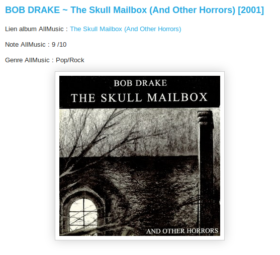

CMD-AllMusic
===========
Userscript that displays some informations from AllMusic on CMD website.

Installation
===========
* Install [GreaseMonkey](https://addons.mozilla.org/fr/firefox/addon/greasemonkey/).

* Navigate to this [page](https://github.com/skw4y/CMD-AllMusic/raw/master/CMD_AllMusic.user.js).

* A popup will show up. Just click on "Install". That's it!

Usage
===========
When the script is installed, navigate to an article page like this [one](http://le-club-des-mangeurs-de-disques.blogspot.fr/2014/07/bob-drake-skull-mailbox-and-other.html).
The following informations are displayed automatically:
* Album link

* Rating

* Genre

Example:

	 
Contact
=======
You can contact me at: string.Format("{0}#{1}","contact","skway.fr").Replace("#","@");

Donations are welcome:
- BTC: 174Eud8voesGp3YcpzjZJGjcjYAr2V42fH

Written by Skw4y in 2014. Released under the terms of the MIT License.  

